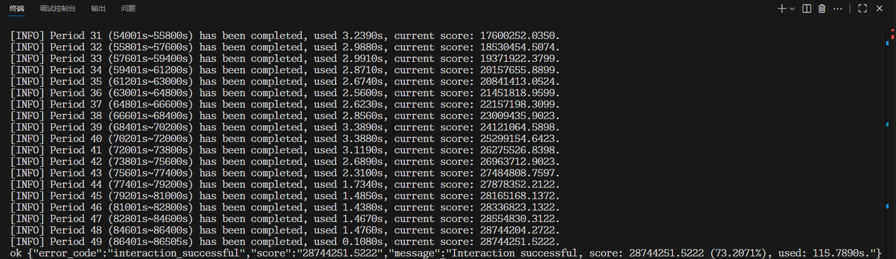
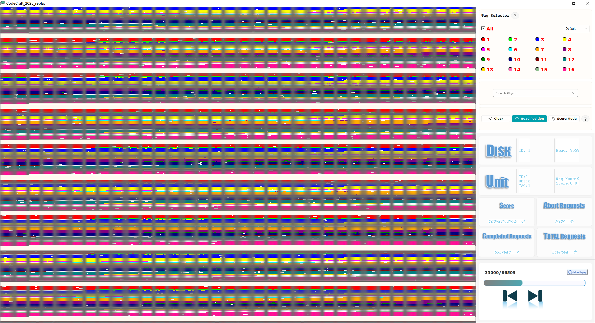

# 2025 华为软件精英挑战赛

这里是我们参加「[2025 华为软件精英挑战赛-普朗克计划](https://developer.huaweicloud.com/codecraft2025)」的记录，本仓库的代码是**初赛代码**。我们的代码在初赛提供的数据集中跑出了 2800w+ 的分数，最后也是成功进入了西北赛区 32 强，晋级复赛。**如果可以请给个 Star！🤞🤞🤞**

- 分数展示

- 对象在磁盘中的储存分布可视化展示

比赛中使用到的数据集和磁盘可视化程序比较大，上传不了 github，它们[在这里](https://www.kdocs.cn/l/cqrzRCjY0jbs)。

---

Tips：闲来无事，整理一下文件，所以就把代码上传了。参加本次比赛对我本人来说是一段很好且难忘的历程，我从中也收获到了很多东西。
